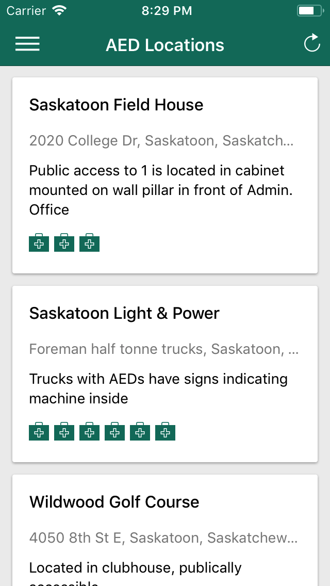
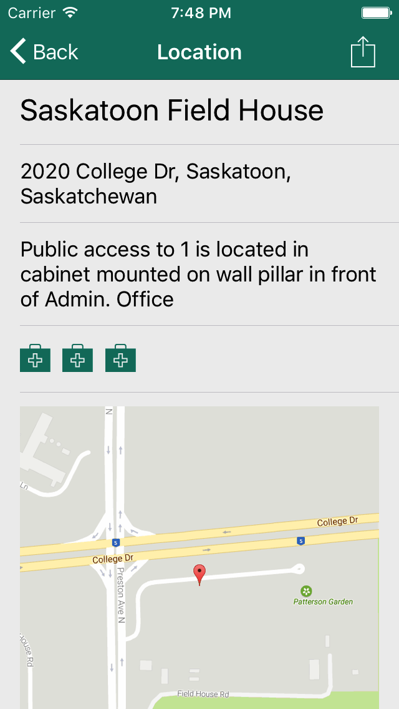
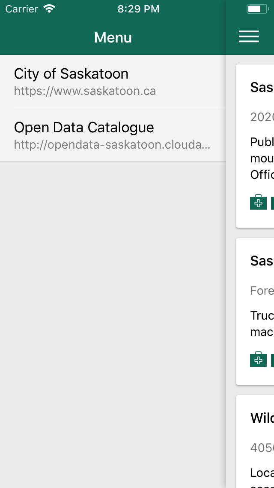

# Saskatoon AED Locations
### An iOS and Android app to show the AED locations in Saskatoon.

### The app was developed in an afternoon to showcase the cities open data initiative.

---

### City of Saskatoon
[https://www.saskatoon.ca](https://www.saskatoon.ca)

### Saskatoon Open Data Catalogue
[http://opendata-saskatoon.cloudapp.net](http://opendata-saskatoon.cloudapp.net)

### Saskatoon AED Locations
[http://opendata-saskatoon.cloudapp.net/DataBrowser/SaskatoonOpenDataCatalogueBeta/AEDLocations#param=NOFILTER--DataView--Results](http://opendata-saskatoon.cloudapp.net/DataBrowser/SaskatoonOpenDataCatalogueBeta/AEDLocations#param=NOFILTER--DataView--Results)

---

### iOS
[AED.ipa](builds/AED.ipa)

#### Run
```
ionic cordova run ios --livereload --consolelogs --serverlogs --address localhost --port 3000
```

#### Build
```
rvm use system
ionic cordova build ios --prod --release -- --buildConfig=build.json
```

---

### Android
[AED.apk](builds/AED.apk)

#### Run
```
ionic cordova run android --livereload --consolelogs --serverlogs --address localhost --port 3000
```

#### Build
```
ionic cordova build android --prod --release --device -- --buildConfig=build.json
```
```
zip -d platforms/android/build/outputs/apk/android-release.apk META-INF/\*
```
```
jarsigner -verbose -sigalg SHA1withRSA -digestalg SHA1 -keystore saskatoon.keystore -storepass Saskatoon -keypass Saskatoon platforms/android/build/outputs/apk/android-release.apk saskatoon
```
```
./zipalign -f -v 4 platforms/android/build/outputs/apk/android-release.apk build/AED.apk
```

---

### Listing


---

### Details


---

### Menu


---

### License
```
MIT License

Copyright (c) 2017 Dale Zak

Permission is hereby granted, free of charge, to any person obtaining a copy
of this software and associated documentation files (the "Software"), to deal
in the Software without restriction, including without limitation the rights
to use, copy, modify, merge, publish, distribute, sublicense, and/or sell
copies of the Software, and to permit persons to whom the Software is
furnished to do so, subject to the following conditions:

The above copyright notice and this permission notice shall be included in all
copies or substantial portions of the Software.

THE SOFTWARE IS PROVIDED "AS IS", WITHOUT WARRANTY OF ANY KIND, EXPRESS OR
IMPLIED, INCLUDING BUT NOT LIMITED TO THE WARRANTIES OF MERCHANTABILITY,
FITNESS FOR A PARTICULAR PURPOSE AND NONINFRINGEMENT. IN NO EVENT SHALL THE
AUTHORS OR COPYRIGHT HOLDERS BE LIABLE FOR ANY CLAIM, DAMAGES OR OTHER
LIABILITY, WHETHER IN AN ACTION OF CONTRACT, TORT OR OTHERWISE, ARISING FROM,
OUT OF OR IN CONNECTION WITH THE SOFTWARE OR THE USE OR OTHER DEALINGS IN THE
SOFTWARE.
```
